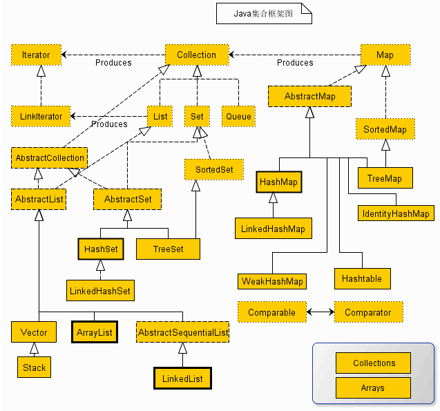

## 一. 掌握Collection和Map的继承体系。

### (1). 掌握各个集合类的特点和实现原理。
- Collection接口有两个主要的子接口List和Set，注意Map不是；
- Collection中可以存储的元素间无序，可以重复组各自独立的元素。

#### 1). List接口
List中存储的元素实现类排序，而且可以重复的存储相关元素。
同时List接口又有两个常用的实现类ArrayList和LinkedList；

**ArrayList优缺点：**
- 优点: 类似数组的形式进行存储，因此它的随机访问速度极快。
- 缺点: 不适合于在线性表中间需要频繁进行插入和删除操作。因为每次插入和删除都需要移动数组中的元素。

**ArrayList重点：**
+ a). 若在初始化ArrayList时没有指定初始化长度的话，默认的长度为10.    
+ b). 增加元素时若超过了ArrayList原始容量，则扩容到“原始容量*3/2+1"，Vector默认扩容方式为则扩容到“原始容量*2”.
+ c). ArrayList是线程不安全的，在多线程的情况下不能使用。在多线程下可以使用Vector，因为Vector中的绝大部分方法都使用了同步关键字(synchronized)修饰.
+ d). ArrayList实现遍历的几种方法：
    - 第一种遍历. 方法使用foreach遍历List
    - 第二种遍历. 把链表变为数组相关的内容进行遍历
    - 第三种遍历. 使用迭代器进行相关遍历
 
**LinkedList**
- 优点: 适合于在链表中间需要频繁进行插入和删除操作。
- 缺点: 随机访问速度较慢。查找一个元素需要从头开始一个一个的找
 
#### 2). Set接口
- Set中的元素实现了不重复，无序,最多允许有一个null元素对象；
- Set接口的常见实现类有HashSet,LinedHashSet和TreeSet这三个。

**HashSet**

HashSet是Set接口的最常见的实现类，其底层是基于Hash算法进行存储；
- a). HashSet中允许存放null值；
- b). HashSet中存储元素的位置是固定的, 元素顺序是无序的；
- c). 遍历HashSet的几种方法：
    - 第一种遍历. 方法使用foreach遍历List
    - 第二种遍历，把链表变为数组相关的内容进行遍历
    - 第三种遍历，使用迭代器进行相关遍历
 
**LinedHashSet**

底层是基于LinkedHashMap来实现的，它和HashSet主要区别在于LinkedHashSet中存储的元素是在哈希算法的基础上增加了链式表的结构。       
 
**TreeSet**

TreeSet是一种排序二叉树。存入Set集合中的值，会按照值的大小进行相关的排序操作。底层算法是基于红黑树来实现的;
 
#### 3). Map接口

Map接口实现的是一组Key-Value的键值对的组合。 
Map接口不直接继承于Collection接口，因为它包装的是一组成对的“键-值”对象的集合，
而且在Map接口的集合中也不能有重复的key出现，因为每个键只能与一个成员元素相对应。

Map有两种比较常用的实现：HashMap和TreeMap等。

***HashMap：*** 基于哈希表实现。使用HashMap要求添加的键类明确定义了hashCode()和equals()，为了优化HashMap空间的使用，您可以调优初始容量和负载因子。
+ (1) HashMap(): 构建一个空的哈希映像
+ (2) HashMap(Map m): 构建一个哈希映像，并且添加映像m的所有映射
+ (3) HashMap(int initialCapacity): 构建一个拥有特定容量的空的哈希映像
+ (4) HashMap(int initialCapacity, float loadFactor): 构建一个拥有特定容量和加载因子的空的哈希映像
    
***TreeMap：*** 基于红黑树实现。TreeMap没有调优选项，因为该树总处于平衡状态。
+ (1)TreeMap():构建一个空的映像树
+ (2)TreeMap(Map m): 构建一个映像树，并且添加映像m中所有元素
+ (3)TreeMap(Comparator c): 构建一个映像树，并且使用特定的比较器对关键字进行排序
+ (4)TreeMap(SortedMap s): 构建一个映像树，添加映像树s中所有映射，并且使用与有序映像s相同的比较器排序
 
两种常规Map性能
- HashMap：适用于在Map中插入、删除和定位元素。
- Treemap：适用于按自然顺序或自定义顺序遍历键(key)。
 
**总结:**
HashMap通常比TreeMap快一点(树和哈希表的数据结构使然)，建议多使用HashMap，在需要排序的Map时候才用TreeMap。

[========]

二. CopyOnWriteArrayList、CopyOnWriteArraySet、ConcurrentHashMap的实现原理和适用场景。
ConcurrentHashMap代替同步的Map（Collections.synchronized（new HashMap()）），众所周知，HashMap是根据散列值分段存储的，同步Map在同步的时候锁住了所有的段，而ConcurrentHashMap加锁的时候根据散列值锁住了散列值锁对应的那段，因此提高了并发性能。ConcurrentHashMap也增加了对常用复合操作的支持，比如"若没有则添加"：putIfAbsent()，替换：replace()。这2个操作都是原子操作。
	CopyOnWriteArrayList和CopyOnWriteArraySet分别代替List和Set，主要是在遍历操作为主的情况下来代替同步的List和同步的Set，这也就是上面所述的思路：迭代过程要保证不出错，除了加锁，另外一种方法就是"克隆"容器对象。
ConcurrentLinkedQuerue是一个先进先出的队列。它是非阻塞队列。
ConcurrentSkipListMap可以在高效并发中替代SoredMap。
ConcurrentSkipListSet可以在高效并发中替代SoredSet。
 
三. Collections 和 Arrays
Collections是java.util下的一个专用静态类，提供一系列静态方法实现对各种集合的搜索、排序、线程安全化等操作；
Arrays 静态类专门用来操作array ，提供搜索、排序、复制等静态方法。
equals()比较两个array是否相等; sort()用来对array进行排序; binarySearch()在排好序的arrasy中寻找元素;
四．HashMap与HashTable区别
HashMap和HashTable都实现了Map接口，但决定用哪一个之前先要弄清楚它们之间的分别。主要的区别有：线程安全性，同步(synchronization)，以及速度。
1. HashMap几乎可以等价于HashTable，除了HashMap是非synchronized的，并可以接受null(HashMap可以接受为null的键值(key)和值(value)，而HashTable则不行)。
2.HashMap是非synchronized，而HashTable是synchronized，这意味着HashTable是线程安全的，多个线程可以 共享一个HashTable；而如果没有正确的同步的话，多个线程是不能共享HashMap的。Java 5提供了ConcurrentHashMap，它是HashTable的替代，比HashTable的扩展性更好。
3. 由于HashTable是线程安全的也是synchronized，所以在单线程环境下它比HashMap要慢。如果你不需要同步，只需要单一线程，那么使用HashMap性能要好过HashTable。
五．Vector 与 ArrayList区别
一. 同步性:Vector是线程安全的，同步的，而ArrayList是线程序不安全的，不同步的 
二. 数据增长:当需要增长时,Vector默认增长为old*2，而ArrayList是old*3/2+1 