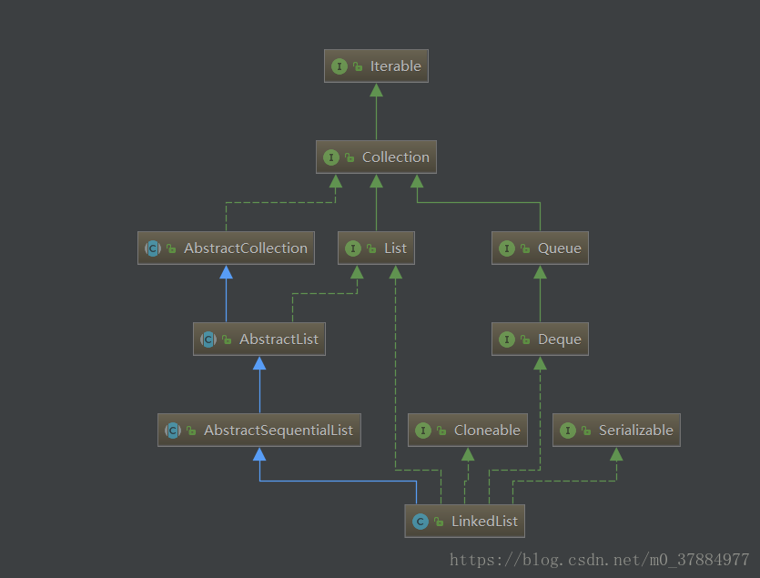
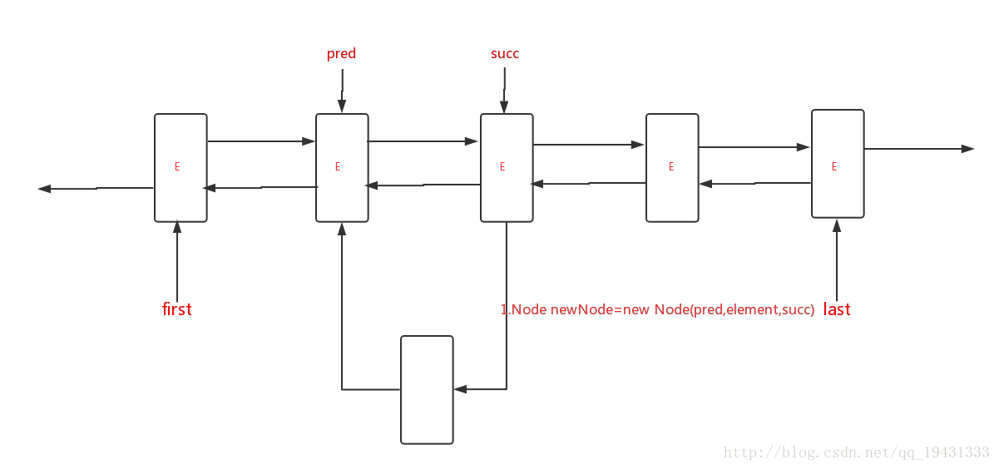
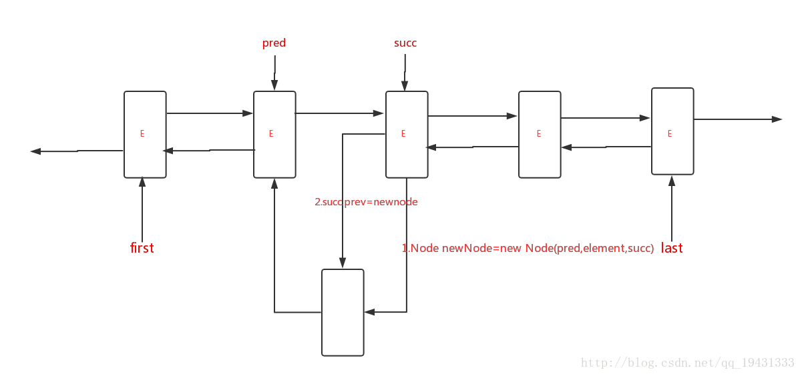

## 文章目录


- [一、LinkedList概述](#一、LinkedList概述)
    - [1.1 LinkedList类图结构](#1.1-linkedlist类图结构)
    - [1.2 LinkedList内部结构](#1.2-linkedlist内部结构)
- [二、LinkedList源码分析](#二、linkedlist源码分析)
    - [2.1 构造方法](#2.1-构造方法)
    - [2.2 添加操作](#2.2-添加操作)
        - [2.1.1 list接口的添加操作](#2.2.1-list接口的添加操作)
        - [2.1.2 deque接口的添加操作](#2.2.2-deque接口的添加操作)
        - [2.1.3 添加操作总结](#2.2.3-添加操作总结)
    - [2.3 检索操作](#2.3-检索操作)
        - [2.3.1 根据位置取数据](#2.3.1-根据位置取数据)
        - [2.3.2 根据对象得到索引](#2.3.2-根据对象得到索引)
        - [2.3.3 检查链表是否包含某对象](#2.3.3-检查链表是否包含某对象)
        - [2.3.4 检索操作总结](#2.3.4-检索操作总结)
- [三、例子](#三、例子)
- [四、总结](#四、总结)


----

### 一、LinkedList概述

LinkedList是一个实现了List接口和Deque接口的双端链表。

有关索引的操作可能从链表头开始遍历到链表尾部，也可能从尾部遍历到链表头部，这取决于看索引更靠近哪一端。

LinkedList不是线程安全的，如果想使LinkedList变成线程安全的，可以使用如下方式：
```java
List list=Collections.synchronizedList(new LinkedList(...));
```
iterator()和listIterator()返回的迭代器都遵循fail-fast机制。

#### 1.1 LinkedList类图结构

LinkedList的继承关系如下图所示：



从图中我们可以看出：

- 继承了AbstractSequentialList抽象类：在遍历LinkedList的时候，官方更推荐使用顺序访问，
  也就是使用我们的迭代器。因为LinkedList底层是通过一个链表来实现的，虽然LinkedList也提供了get（int index）方法，
  但是底层的实现是：每次调用get（int index）方法的时候，都需要从链表的头部或者尾部进行遍历，
  每一的遍历时间复杂度是O(index)，而相对比ArrayList的底层实现，每次遍历的时间复杂度都是O(1)。
  所以不推荐通过get（int index）遍历LinkedList。
  至于上面的说从链表的头部后尾部进行遍历：官方源码对遍历进行了优化：
  通过判断索引index更靠近链表的头部还是尾部来选择遍历的方向，所以这里遍历LinkedList推荐使用迭代器。
- 实现了List接口。（提供List接口中所有方法的实现）
- 实现了Cloneable接口，它支持克隆（浅克隆），底层实现：LinkedList节点并没有被克隆，
  只是通过Object的clone（）方法得到的Object对象强制转化为了LinkedList,然后把它内部的实例域都置空，
  然后把被拷贝的LinkedList节点中的每一个值都拷贝到clone中。（后面有源码解析）
- 实现了Deque接口。实现了Deque所有的可选的操作。
- 实现了Serializable接口。表明它支持序列化。和ArrayList一样，底层都提供了两个方法：
  readObject（ObjectInputStream o）、writeObject（ObjectOutputStream o），用于实现序列化，
  底层只序列化节点的个数和节点的值）。

#### 1.2 LinkedList内部结构

**LinkedList内部是一个双端链表的结构，结构如下图：**


从上图可以看出，LinkedList内部是一个双端链表结构，有两个变量，first指向链表头部，last指向链表尾部

**LinkedList内部的成员变量如下**：
```java
transient int size = 0;

transient Node<E> first;

transient Node<E> last;
```
其中size表示当前链表中的数据个数。下面是Node节点的定义，Node类LinkedList的静态内部类。
```java
    private static class Node<E> {
        E item;
        Node<E> next;
        Node<E> prev;

        Node(Node<E> prev, E element, Node<E> next) {
            this.item = element;
            this.next = next;
            this.prev = prev;
        }
    }
```
从Node的定义可以看出链表是一个双端链表的结构。


### 二、LinkedList源码分析

#### 2.1 构造方法
LinkedList有两个构造方法，一个用于构造一个空的链表，一个用已有的集合创建链表。如下：
```java
        public LinkedList() {
        }
    
        public LinkedList(Collection<? extends E> c) {
            this();
            addAll(c);//添加集合中所有元素
        }
```
当使用第二个构造方法时，会调用addAll()方法将集合中的元素添加到链表中，添加的操作后面会详细介绍

#### 2.2 添加操作

因为LinkedList即实现了List接口，又实现了Deque接口，所以LinkedList既可以添加将元素添加到尾部，
也可以将元素添加到指定索引位置，还可以添加添加整个集合；另外既可以在头部添加，又可以在尾部添加。

下面我们分别从List接口和Deque接口分别介绍。

##### 2.2.1 List接口的添加操作

**add(E e)**

add(E e)用于将元素添加到链表尾部，实现如下:
```java
    public boolean add(E e) {
        linkLast(e);
        return true;
    }

    void linkLast(E e) {
        final Node<E> l = last;//指向链表尾部
        final Node<E> newNode = new Node<>(l, e, null);//以尾部为前驱节点创建一个新节点
        last = newNode;//将链表尾部指向新节点
        if (l == null)//如果链表为空，那么该节点既是头节点也是尾节点
            first = newNode;
        else//链表不为空，那么将该结点作为原链表尾部的后继节点
            l.next = newNode;
        size++;//增加尺寸
        modCount++;
    }
```
从上面代码可以看到，linkLast方法中就是一个链表尾部添加一个双端节点的操作，但是需要注意对链表为空时头节点的处理

**add(int index,E e)**

add(int index,E e)用于在指定位置添加元素。实现如下：
```java
    public void add(int index, E element) {
        checkPositionIndex(index); //检查索引是否处于[0-size]之间

        if (index == size)//添加在链表尾部
            linkLast(element);
        else//添加在链表中间
            linkBefore(element, node(index));
    }
```
从上面代码可以看到，主要分为3步：
1. 检查index的范围，否则抛出异常
2. 如果插入位置是链表尾部，那么调用linkLast方法
3. 如果插入位置是链表中间，那么调用linkBefore方法

linkLast方法前面已经讨论了，下面看一下linkBefore的实现。
在看linkBefore之前，先看一下node(int index)方法，该方法返回指定位置的节点，实现如下：
```java
    Node<E> node(int index) {
        // assert isElementIndex(index);

        //如果索引位置靠链表前半部分，从头开始遍历
        if (index < (size >> 1)) {
            Node<E> x = first;
            for (int i = 0; i < index; i++)
                x = x.next;
            return x;
        }
        //否则，从尾开始遍历
        else {
            Node<E> x = last;
            for (int i = size - 1; i > index; i--)
                x = x.prev;
            return x;
        }
    }
```

从上面可以看到，node(int index)方法将根据index是靠近头部还是尾部选择不同的遍历方向。
一旦得到了指定索引位置的节点，再看linkBefore()方法，实现如下：
```java
    void linkBefore(E e, Node<E> succ) {
        // assert succ != null;
        final Node<E> pred = succ.prev;
        final Node<E> newNode = new Node<>(pred, e, succ);
        succ.prev = newNode;
        if (pred == null)
            first = newNode;
        else
            pred.next = newNode;
        size++;
        modCount++;
    }
```
linkBefore()方法在第二个参数节点之前插入一个新节点。示意图如下：




从上图以及代码可以看到linkBefore主要分三步：
1. 创建newNode节点，将newNode的后继指针指向succ，前驱指针指向pred
2. 将succ的前驱指针指向newNode
3. 根据pred是否为null，进行不同操作。
    - 如果pred为null，说明该节点插入在头节点之前，要重置first头节点
    - 如果pred不为null，那么直接将pred的后继指针指向newNode即可

**addAll方法**

addAll有两个重载方法，一个参数的方法表示将集合元素添加到链表尾部，而两个参数的方法指定了开始插入的位置。
实现如下：
```java
    //将集合插入到链表尾部，即开始索引位置为size
    public boolean addAll(Collection<? extends E> c) {
        return addAll(size, c);
    }

    //将集合从指定位置开始插入
    public boolean addAll(int index, Collection<? extends E> c) {
        //Step 1:检查index范围
        checkPositionIndex(index);

        //Step 2:得到集合的数据
        Object[] a = c.toArray();
        int numNew = a.length;
        if (numNew == 0)
            return false;

        //Step 3：得到插入位置的前驱节点和后继节点
        Node<E> pred, succ;
        //如果插入位置为尾部，前驱节点为last，后继节点为null
        if (index == size) {
            succ = null;
            pred = last;
        }
        //否则，调用node()方法得到后继节点，再得到前驱节点
        else {
            succ = node(index);
            pred = succ.prev;
        }

        //Step 4：遍历数据将数据插入
        for (Object o : a) {
            @SuppressWarnings("unchecked") E e = (E) o;
            //创建新节点
            Node<E> newNode = new Node<>(pred, e, null);
            //如果插入位置在链表头部
            if (pred == null)
                first = newNode;
            else
                pred.next = newNode;
            pred = newNode;
        }

        //如果插入位置在尾部，重置last节点
        if (succ == null) {
            last = pred;
        }
        //否则，将插入的链表与先前链表连接起来
        else {
            pred.next = succ;
            succ.prev = pred;
        }

        size += numNew;
        modCount++;
        return true;
    }  
```
从上面的代码可以看到，addAll方法主要分为4步：
1. 检查index索引范围
2. 得到集合数据
3. 得到插入位置的前驱和后继节点
4. 遍历数据，将数据插入到指定位置

##### 2.2.2 Deque接口的添加操作

**addFirst(E e)方法**

addFirst()方法用于将元素添加到链表头部，其实现如下:
```java
    public void addFirst(E e) {
        linkFirst(e);
    }

    private void linkFirst(E e) {
        final Node<E> f = first;
        final Node<E> newNode = new Node<>(null, e, f);//新建节点，以头节点为后继节点
        first = newNode;
        //如果链表为空，last节点也指向该节点
        if (f == null)
            last = newNode;
        //否则，将头节点的前驱指针指向新节点
        else
            f.prev = newNode;
        size++;
        modCount++;
    }
```
从上面的代码看到，实现就是在头节点插入一个节点使新节点成为新节点，
但是和linkLast一样需要注意当链表为空时，对last节点的设置。

**addLast(E e)方法**

addLast()方法用于将元素添加到链表尾部，与add()方法一样。所以实现也一样，如下：
```java
    public void addLast(E e) {
        linkLast(e);
    }
```

**offer(E e)方法**

offer(E e)方法用于将数据添加到链表尾部，其内部调用了add(E e)方法，如下：
```java
    public boolean offer(E e) {
        return add(e);
    }
```

**offerFirst(E e)方法**

offerFirst()方法用于将数据插入链表头部，与addFirst的区别在于该方法可以返回特定的返回值，
而addFirst的返回值为void。
```java
    public boolean offerFirst(E e) {
        addFirst(e);
        return true;
    }
```

**offerLast(E e)方法**

offerLast()与addLast()的区别和offerFirst()和addFirst()的区别一样，所以这儿就不多说了。

##### 2.2.3 添加操作总结
LinkedList由于实现了List和Deque接口，所以有多种添加方法，下面总结了一下。
- 将数据插入到链表尾部
    - boolean add(E e):
    - void addLast(E e)
    - void push(E e)
    - boolean offerLast(E e)
- 将数据插入到链表头部
    - void addFirst(E e)
    - boolean offerFirst(E e)
- 将数据插入到指定索引位置
    - boolean add(int index,E e)


#### 2.3 检索操作

##### 2.3.1 根据位置取数据

**获取任意位置的get(int index)方法**

get(int index)方法根据指定索引返回数据，如果索引越界，那么会抛出异常。实现如下：
```java
    public E get(int index) {
        //检查边界
        checkElementIndex(index);
        return node(index).item;
    }
```
从上面的代码可以看到分为2步：

1. 检查index边界，index>=0&&index
2. 获取index对应的节点内容

**获得位置为index的头节点数据**

LinkedList中有多种方法可以获得头节点的数据，实现大同小异，区别在于对链表为空时的处理，是抛出异常还是返回null。
主要方法有getFirst()、element()、peek()、peekFirst()、方法。
其中getFirst()和element()方法将会在链表为空时，抛出异常，它们的实现如下：
```java
    public E getFirst() {
        final Node<E> f = first;
        if (f == null)
            throw new NoSuchElementException();
        return f.item;
    }
    public E element() {
        return getFirst();
    }
```

从代码可以看到，element()方法的内部就是使用getFirst()实现的。
它们会在链表为空时，抛出NoSuchElementException。

下面再看peek()和peekFirst()的实现：
```java
    public E peek() {
        final Node<E> f = first;
        return (f == null) ? null : f.item;
    }

    public E peekFirst() {
        final Node<E> f = first;
        return (f == null) ? null : f.item;
     }
```
从代码可以看到，当链表为空时，peek()和peekFirst()方法返回null。

**获得位置为size-1的尾节点数据**

获得尾节点数据的方法有getLast()和peekLast()。getLast()的实现如下：
```java
    public E getLast() {
        final Node<E> l = last;
        if (l == null)
            throw new NoSuchElementException();
        return l.item;
    }
```

可以看到，getLast()方法在链表为空时，会抛出NoSuchElementException，

而peekLast()则不会，只是会返回null。实现如下：
```java
    public E peekLast() {
        final Node<E> l = last;
        return (l == null) ? null : l.item;
    }
```


##### 2.3.2 根据对象得到索引

根据对象得到索引分为两种，一种是第一个匹配的索引，一个是最后一个匹配的索引，
实现的在于一个从前往后遍历，一个从后往前遍历。下面先看idnexOf()方法的实现：
```java
    //返回第一个匹配的索引
    public int indexOf(Object o) {
        int index = 0;
        if (o == null) {
            //从头往后遍历
            for (Node<E> x = first; x != null; x = x.next) {
                if (x.item == null)
                    return index;
                index++;
            }
        } else {
            //从头往后遍历
            for (Node<E> x = first; x != null; x = x.next) {
                if (o.equals(x.item))
                    return index;
                index++;
            }
        }
        return -1;
    }
```

从上面的代码可以看到，LinkedList可以包含null元素，遍历方式都是从前往后，一旦匹配了，就返回索引。

lastIndexOf()方法返回最后一个匹配的索引，实现为从后往前遍历，源码如下：
```java
    //返回最后一个匹配的索引
    public int lastIndexOf(Object o) {
        int index = size;
        if (o == null) {
            //从后向前遍历
            for (Node<E> x = last; x != null; x = x.prev) {
                index--;
                if (x.item == null)
                    return index;
            }
        } else {
            //从后向前遍历
            for (Node<E> x = last; x != null; x = x.prev) {
                index--;
                if (o.equals(x.item))
                    return index;
            }
        }
        return -1;
    }
```


##### 2.3.3 检查链表是否包含某对象

contains(Object o)方法检查对象o是否存在于链表中，其实现如下：
```java
    public boolean contains(Object o) {
        return indexOf(o) != -1;
    }
```
从代码可以看到contains()方法调用了indexOf()方法，只要返回结果不是-1，那就说明该对象存在于链表中

##### 2.3.4 检索操作总结
检索操作分为按照位置得到对象以及按照对象得到位置两种方式，
其中按照对象得到位置的方法有indexOf()和lastIndexOf()；
按照位置得到对象有如下方法：
- 根据任意位置得到数据的get(int index)方法，当index越界会抛出异常
- 获得头节点数据
    - getFirst()和element()方法在链表为空时会抛出NoSuchElementException
    - peek()和peekFirst()方法在链表为空时会返回null
- 获得尾节点数据
    - getLast()在链表为空时会抛出NoSuchElementException
    - peekLast()在链表为空时会返回null
    
#### 2.4 删除操作
删除操作分为按照位置删除和按照对象删除，其中按照位置删除的方法又有区别，有的只是返回是否删除成功的标志，
有的还需要返回被删除的元素。下面分别讨论。

##### 2.4.1 删除指定对象

当删除指定对象时，只需调用remove(Object o)即可，不过该方法一次只会删除一个匹配的对象，
如果删除了匹配对象，返回true，否则false。其实现如下：
```java
    public boolean remove(Object o) {
        //如果删除对象为null
        if (o == null) {
            //从前向后遍历
            for (Node<E> x = first; x != null; x = x.next) {
                //一旦匹配，调用unlink()方法和返回true
                if (x.item == null) {
                    unlink(x);
                    return true;
                }
            }
        } else {
            //从前向后遍历
            for (Node<E> x = first; x != null; x = x.next) {
                //一旦匹配，调用unlink()方法和返回true
                if (o.equals(x.item)) {
                    unlink(x);
                    return true;
                }
            }
        }
        return false;
    }
```

从代码可以看到，由于LinkedList可以存储null元素，所以对删除对象以是否为null做区分。
然后从链表头开始遍历，一旦匹配，就会调用unlink()方法将该节点从链表中移除。

下面是unlink()方法的实现：
```java
    E unlink(Node<E> x) {
        // assert x != null;
        final E element = x.item;
        final Node<E> next = x.next;//得到后继节点
        final Node<E> prev = x.prev;//得到前驱节点

        //删除前驱指针
        if (prev == null) {
            first = next;如果删除的节点是头节点,令头节点指向该节点的后继节点
        } else {
            prev.next = next;//将前驱节点的后继节点指向后继节点
            x.prev = null;
        }

        //删除后继指针
        if (next == null) {
            last = prev;//如果删除的节点是尾节点,令尾节点指向该节点的前驱节点
        } else {
            next.prev = prev;
            x.next = null;
        }

        x.item = null;
        size--;
        modCount++;
        return element;
    }
```
上面的代码可以用如下示意图来解释：

第一步：得到待删除节点的前驱节点和后继节点

第二步：删除前驱节点

第三步：删除后继节点

经过三步，待删除的结点就从链表中脱离了。需要注意的是删除位置是头节点或尾节点时候的处理，
上面的示意图没有特别指出。

##### 2.4.2 按照位置删除对象

**删除任意位置的对象**
boolean remove(int index)方法用于删除任意位置的元素，如果删除成功将返回true，否则返回false。实现如下：
```java
    public E remove(int index) {
        //检查index范围
        checkElementIndex(index);
        //将节点删除
        return unlink(node(index));
    }
```
从上面可以看到remove(int index)操作有两步：
1. 检查index范围，属于[0,size）
2. 将索引出节点删除


**删除头节点的对象**
删除头节点的对象的方法有很多，包括remove()、removeFirst()、pop()、poll()、pollFirst()，
其中前三个方法在链表为空时将抛出NoSuchElementException，后两个方法在链表为空时将返回null。

remove()、pop()、removeFirst()的实现如下：
```java
    public E remove() {
        return removeFirst();
    }

    public E pop() {
        return removeFirst();
    }

    public E removeFirst() {
        final Node<E> f = first;
        if (f == null)
            throw new NoSuchElementException();
        return unlinkFirst(f);
    }
```
从上面代码可以看到，remove()和pop()内部调用了removeFirst()方法，而removeFirst()在链表为空时将抛出NoSuchElementException。

下面是poll()和pollFirst()的实现：
```java
    public E poll() {
        final Node<E> f = first;
        return (f == null) ? null : unlinkFirst(f);
    }

    public E pollFirst() {
        final Node<E> f = first;
        return (f == null) ? null : unlinkFirst(f);
    }
```
可以看到poll()和pollFirst()的实现代码是相同的，在链表为空时将返回null。

**删除尾节点的对象**
删除尾节点的对象的方法有removeLast()和pollLast()。

removeLast的实现如下：
```java
    public E removeLast() {
        final Node<E> l = last;
        if (l == null)
            throw new NoSuchElementException();
        return unlinkLast(l);
    }
```
可以看到removeLast()在链表为空时将抛出NoSuchElementException。

而pollLast()方法则不会，如下：
```java
    public E pollLast() {
        final Node<E> l = last;
        return (l == null) ? null : unlinkLast(l);
    }
```
可以看到pollLast()在链表为空时会返回null，而不是抛出异常。

##### 2.4.3 删除操作总结
删除操作由很多种方法，有：
- 按照指定对象删除：boolean remove(Object o)，一次只会删除一个匹配的对象
- 按照指定位置删除
    - 删除任意位置的对象：E remove(int index),当index越界时会抛出异常
    - 删除头节点位置的对象
        - 在链表为空时抛出异常：E remove()、E removeFirst()、E pop()
        - 在链表为空时返回null：E poll()、E pollFirst()
    - 删除尾节点位置的对象
        - 在链表为空时抛出异常：E removeLast()
        - 在链表为空时返回null：E pollLast()
        
#### 2.5 迭代器操作
LinkedList的iterator()方法内部调用了其listIterator()方法，所以可以只分析listIterator()方法。
listIterator()提供了两个重载方法。iterator()方法和listIterator()方法的关系如下：
```java
    public Iterator<E> iterator() {
        return listIterator();
    }
    
    public ListIterator<E> listIterator() {
        return listIterator(0);
    }

    public ListIterator<E> listIterator(int index) {
        checkPositionIndex(index);
        return new ListItr(index);
    }
```
从上面可以看到三者的关系是iterator()——>listIterator(0)——>listIterator(int index)。
最终都会调用listIterator(int index)方法，其中参数表示迭代器开始的位置。
在ArrayList源码分析中提到过ListIterator是一个可以指定任意位置开始迭代，并且有两个遍历方法。

下面直接看ListItr的实现：
```java
    private class ListItr implements ListIterator<E> {
        private Node<E> lastReturned;
        private Node<E> next;
        private int nextIndex;
        private int expectedModCount = modCount;//保存当前modCount，确保fail-fast机制

        ListItr(int index) {
            // assert isPositionIndex(index);
            next = (index == size) ? null : node(index);//得到当前索引指向的next节点
            nextIndex = index;
        }

        public boolean hasNext() {
            return nextIndex < size;
        }

        //获取下一个节点
        public E next() {
            checkForComodification();
            if (!hasNext())
                throw new NoSuchElementException();

            lastReturned = next;
            next = next.next;
            nextIndex++;
            return lastReturned.item;
        }

        public boolean hasPrevious() {
            return nextIndex > 0;
        }

        //获取前一个节点，将next节点向前移
        public E previous() {
            checkForComodification();
            if (!hasPrevious())
                throw new NoSuchElementException();

            lastReturned = next = (next == null) ? last : next.prev;
            nextIndex--;
            return lastReturned.item;
        }

        public int nextIndex() {
            return nextIndex;
        }

        public int previousIndex() {
            return nextIndex - 1;
        }

        public void remove() {
            checkForComodification();
            if (lastReturned == null)
                throw new IllegalStateException();

            Node<E> lastNext = lastReturned.next;
            unlink(lastReturned);
            if (next == lastReturned)
                next = lastNext;
            else
                nextIndex--;
            lastReturned = null;
            expectedModCount++;
        }

        public void set(E e) {
            if (lastReturned == null)
                throw new IllegalStateException();
            checkForComodification();
            lastReturned.item = e;
        }

        public void add(E e) {
            checkForComodification();
            lastReturned = null;
            if (next == null)
                linkLast(e);
            else
                linkBefore(e, next);
            nextIndex++;
            expectedModCount++;
        }

        public void forEachRemaining(Consumer<? super E> action) {
            Objects.requireNonNull(action);
            while (modCount == expectedModCount && nextIndex < size) {
                action.accept(next.item);
                lastReturned = next;
                next = next.next;
                nextIndex++;
            }
            checkForComodification();
        }

        final void checkForComodification() {
            if (modCount != expectedModCount)
                throw new ConcurrentModificationException();
        }
    }
```
在ListIterator的构造器中，得到了当前位置的节点，就是变量next。
next()方法返回当前节点的值并将next指向其后继节点，previous()方法返回当前节点的前一个节点的值并将next节点指向其前驱节点。
由于Node是一个双端节点，所以这儿用了一个节点就可以实现从前向后迭代和从后向前迭代。
另外在ListIterator初始时，exceptedModCount保存了当前的modCount，
如果在迭代期间，有操作改变了链表的底层结构，那么再操作迭代器的方法时将会抛出ConcurrentModificationException。

### 三、例子
由于LinkedList是一个实现了Deque的双端队列，所以LinkedList既可以当做Queue，又可以当做Stack，

下面的例子将用LinkedList实现Stack，代码如下：
```java
public class LinkedStack<E> {

    private LinkedList<E> linkedList;

    public LinkedStack() {
        linkedList = new LinkedList<E>();
    }

    //压入数据
    public void push(E e) {
        linkedList.push(e);
    }

    //弹出数据，在Stack为空时将抛出异常
    public E pop() {
        return linkedList.pop();
    }

    //检索栈顶数据，但是不删除
    public E peek() {
        return linkedList.peek();
    }

}
```
在将LinkedList当做Stack时，使用pop()、push()、peek()方法需要注意的是LinkedList内部是将链表头部当做栈顶，链表尾部当做栈底，也就意味着所有的压入、摊入操作都在链表头部进行。


### 四、总结
LinkedList是基于双端链表的List，其内部的实现源于对链表的操作，
所以适用于频繁增加、删除的情况；该类不是线程安全的；
另外，由于LinkedList实现了Queue接口，所以LinkedList不止有队列的接口，还有栈的接口，
可以使用LinkedList作为队列和栈的实现。


