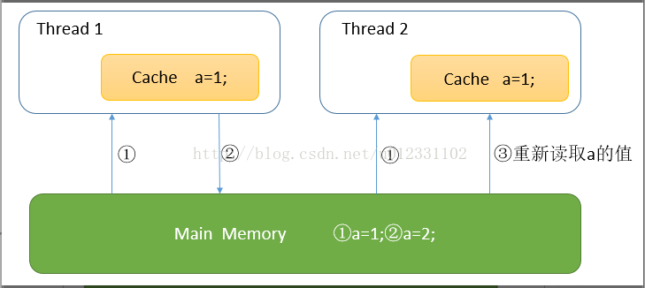

## Volatile和Synchronized实现方式

Volatile和Synchronized在并发执行的过程中为我们提供了锁的功能，
有了锁我们可以保证在多线程执行程序的过程中我们提供更好的并发机制，
下面我们就看一看Volatile和Synchronized到底是如何为我们保证多线程在并发执行过程中的一致性的。

- 在程序执行的过程中我们会涉及到缓存和内存，缓存对于线程来说是独享的，也就是说一个线程单独占有一块缓存，
  其他的线程是无法访问的，而内存对于线程是共享的，多线程执行时，内存中的数据是可以被几条线程共同读取和写入的。

- 通常来说线程执行时都是和缓存打交道的，也就是说如果一个线程要读取一个变量的值那么它是从缓存中读取的，
  然后执行完后写入到缓存中，然后在由缓存写入到内存中。

- 当线程要使用Volatile修饰的变量时，它会从内存中去读取，而不是从缓存中读取，因为缓存中的数据可能已经过期了。

      

看一个例子，
① 两个线程分别为Thread1和Thread2，从内存中分别读取了变量a的值，此时在两个线程的缓存中内存的值都为1。
② Thread1将a的值修改为2，这个缓存回写会导致其他处理器的缓存无效，此时Thread2中读取到的值就已经过期了，那么当Thread2要使用a的时候，会重新从内存中读取这个值。

以上的的说明，指出了使用Volatile可以保证可见性，也就是说一个线程回写了变量的值其他的线程是可以知道这个值被修改过。

但是Volatile并不能保证原子性，即使只是i++，实际上也是由多个原子操作组成：read i; inc; write i，假如多个线程同时执行i++，Volatile只能保证他们操作的i是同一块内存，但依然可能出现写入脏数据的情况。
因为在实际的执行过程中并不能每次都能保证线程读取到的是最新的值。

在java虚拟机中，每个对象和类在逻辑上都是和一个监视器相关联的。对于对象来说，相关联的监视器保护对象的实例变量。对于类来说，监视器保护类的类变量。
为了实现监视器的排他性监视能力，java虚拟机为每一个对象和类都关联一个锁。代表任何时候只允许一个线程拥有的特权。
线程访问实例变量或者类变量不需锁。一个线程可以多次对同一个对象上锁。对于每一个对象，java虚拟机维护一个加锁计数器，
线程每获得一次该对象，计数器就加1，每释放一次，计数器就减 1，当计数器值为0时，锁就被完全释放了。

在java程序中，只需要使用Synchronized块或者Synchronized方法就可以标志一个监视区域。当每次进入一个监视区域时，java 虚拟机都会自动锁上对象或者类。所以说一次只能有一个线程访问Synchronized修饰的对象或者类。而在锁期间其他的线程将会阻塞。

通过对Volatile和Synchronized的简要介绍我们可以得出下面的一些结论
1. Volatile本质是在告诉线程当前变量在缓存中的值是不确定的,需要从主存中读取,Synchronized则是锁定当前变量,只有当前线程可以访问该变量,其他线程被阻塞住.
2. Volatile仅能使用在变量级别,Synchronized则可以使用在变量,方法.
3. Volatile仅能实现变量的修改可见性,而Synchronized则可以保证变量的修改可见性和原子性.
4. Volatile不会造成线程的阻塞,而Synchronized可能会造成线程的阻塞.

